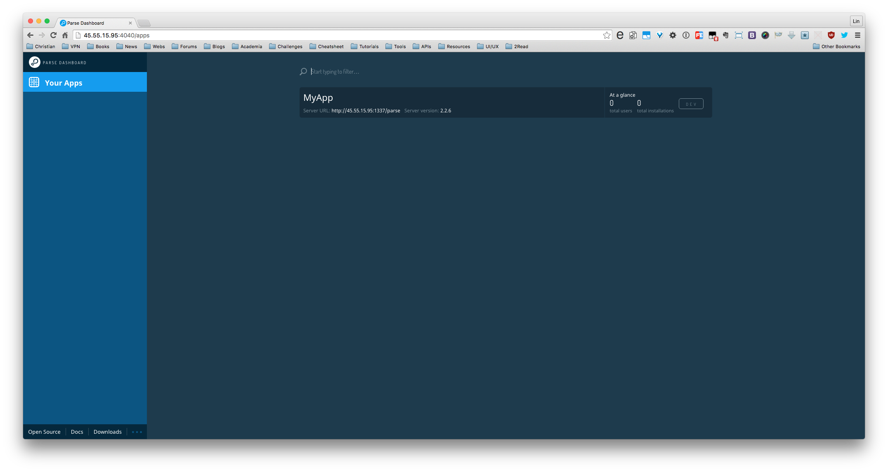
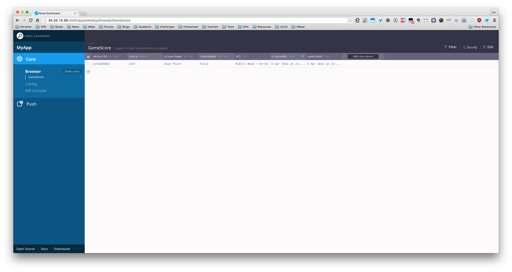

# Install Parse Server standalone version

## Prerequisites

1. [How to Install MongoDB on Ubuntu 14.04 | DigitalOcean](https://www.digitalocean.com/community/tutorials/how-to-install-mongodb-on-ubuntu-14-04)

*Gist*

```
sudo apt-key adv --keyserver hkp://keyserver.ubuntu.com:80 --recv 7F0CEB10

echo "deb http://repo.mongodb.org/apt/ubuntu "$(lsb_release -sc)"/mongodb-org/3.0 multiverse" | sudo tee /etc/apt/sources.list.d/mongodb-org-3.0.list

sudo apt-get update

sudo apt-get install -y mongodb-org

# Check status of mongod
service mongod status
```

## Environment setup

Steps:

1. `npm install -g parse-server mongodb-runner parse-dashboard`


## Instructions

1. `mongodb-runner start`

2. `parse-server --appId myAppId --masterKey myMasterKey`


```
// parse-dashboard-config.json
// MUST change localhost to a public accessible IP, otherwise it wont work
// appId and masterKey must be the same as well.

{
  "apps": [
    {
        "serverURL": "http://localhost:1337/parse",
        "appId": "myAppId",
        "masterKey": "myMasterKey",
        "appName": "MyApp"
    }
  ],
  "users": [
    {
      "user":"andy",
      "pass":"andy"
    },
    {
      "user":"alan",
      "pass":"alan"
    }
  ]
}
```

run `parse-dashboard --config parse-dashboard-config.json --allowInsecureHTTP=1;`

## Screenshots

Login



Loggined




# Reference

1. [ParsePlatform/parse-server: Parse-compatible API server module for Node/Express](https://github.com/ParsePlatform/parse-server)
2. [ParsePlatform/parse-dashboard: A dashboard for managing your Parse apps that aren't hosted on Parse.com](https://github.com/ParsePlatform/parse-dashboard)
3.[ParsePlatform/parse-server: Parse-compatible API server module for Node/Express](https://github.com/ParsePlatform/parse-server#configuration)
4. [How To Run Parse Server on Ubuntu 14.04 | DigitalOcean](https://www.digitalocean.com/community/tutorials/how-to-run-parse-server-on-ubuntu-14-04)
5. [Complete Parse Server migration guide | Julien Renaux Blog](http://julienrenaux.fr/2016/01/29/complete-parse-server-migration-guide/)
6. [如何自行架設 Parse API Server](http://www.jollen.org/blog/2016/02/how-to-setup-parse-api-server.html)
7. [Parse.com 停止服務? 建立自己的 Parse API Server 吧！ | Mr. 沙先生](http://shazi.info/parse-com-%E5%81%9C%E6%AD%A2%E6%9C%8D%E5%8B%99-%E5%BB%BA%E7%AB%8B%E8%87%AA%E5%B7%B1%E7%9A%84-parse-api-server-%E5%90%A7%EF%BC%81/?doing_wp_cron=1460240774.9876430034637451171875)
8. [Initial Server Setup with Ubuntu 14.04 | DigitalOcean](https://www.digitalocean.com/community/tutorials/initial-server-setup-with-ubuntu-14-04)
